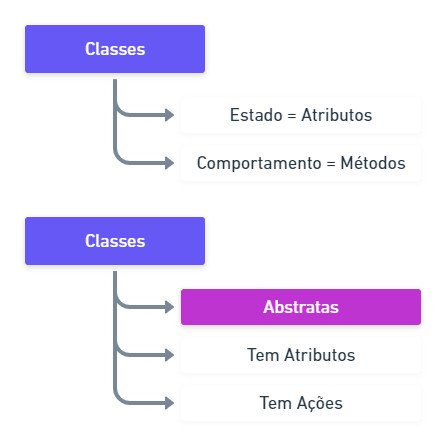
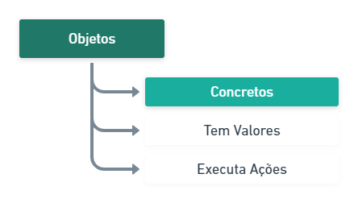
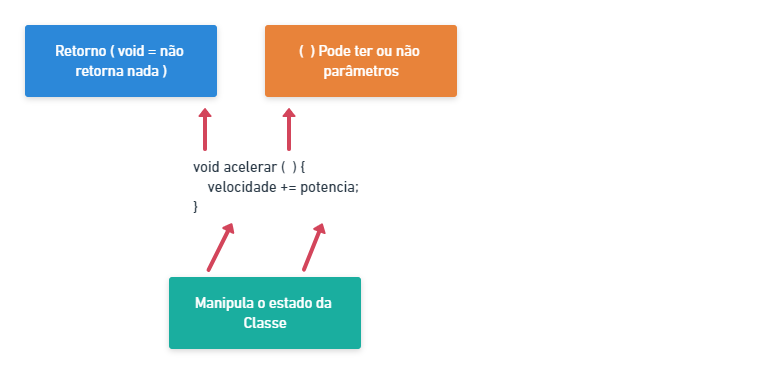
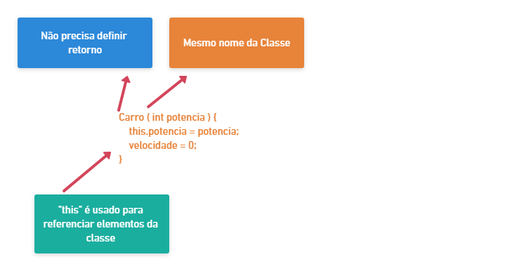

<h1 align="center">Coursera - ITA - Orientação a Objetos com Java </h1>

<h2>📅 Semana 1</h2>

<h3>📝Conhecendo as Classes</h3>

> <h4>Identificando Classes e Objetos</h4>

* Classes 
  * São abstrações;
  

   

* Objetos
  * É Concreto;
  * É uma instância concreta de uma classe;
  * Objetos são únicos;

   

> <h4>Comportamento e Estados das Classes</h4>

* Estado
  * O Estado de uma classe é definido pelos atributos. 
  * As Características de um objeto da classe são chamados de atributos. 

* Comportamento
  * O Comportamento de uma classe é chamado de **método**.

<a href="https://github.com/brunoemferreira/ita-orientacao-a-objetos-com-java/blob/main/Semana1/TestesParaPraticar.md" >📚 Testes para Praticar</a>
<a href="https://github.com/brunoemferreira/ita-orientacao-a-objetos-com-java/blob/main/Semana1/Testes.md" >📚 Testes</a>

<h3>📝 Conhecendo as Classes com Java</h3>

> <h4>Criando Classes com Java</h4>

* Classes costumam ser organizadas em pacotes ( Packages ).
* Para utilizar uma classe de fora do seu pacote, vc deve importar a classe ou o seu pacote relacionado.
* As informações que uma classe precisa saber é armazenada nos atributos.
* Todo atributo precisa ter um tipo.
* Os métodos definem o comportamento da classe.
* Estrutura de um método : 
 
 

     
  

<a href="https://github.com/brunoemferreira/ita-orientacao-a-objetos-com-java/tree/main/Fontes/Carros" >Hands-on: Classes e Objetos</a>

> <h4>Construtores de Classes</h4>

* Os Construtores são "métodos especiais" usados para criar objetos da classe. Com eles você pode parametrisar o objeto criado e inicializar variáveis.
* Quando nenhum construtor é definido, um vazio e sem parâmetros é criado.
* É impossível ter vários construtores com tipos de parâmetros diferentes!

  

     
  

<a href="https://github.com/brunoemferreira/ita-orientacao-a-objetos-com-java/tree/main/Fontes/Comercio" >Hands-on: Construtores Diferentes para a mesma Classe</a>

<h2>📅 Semana 2</h2>
